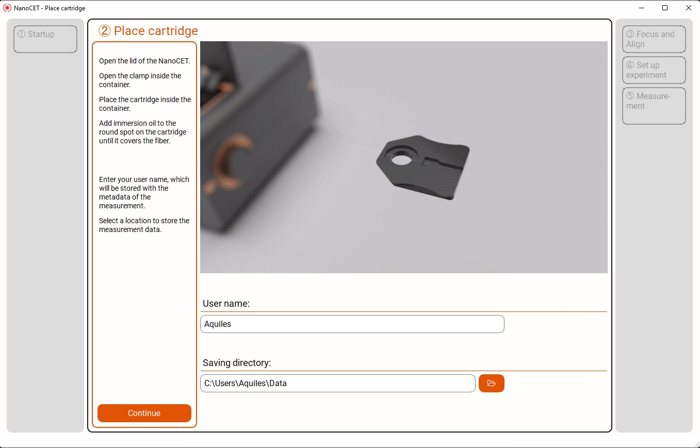

# NanoCETPy

Software to acquire data with [Dispertech's](https://www.dispertech.com) NanoCET device. It implements a friendly user interface developed with QtDesigner and expanded within the code using PyQt5. The software also takes care of the communication with the device, the auto-coupling of the laser to the hollow fibers where the measurement is performed. 

The program follows the MVC pattern: in the Model module the two crucial components are the experiment model, which takes care of the logic behind performing a measurement, including saving the data and the real-time background subtraction for visualization. The View includes all the graphical interface and the logic behind specific elements that the user can trigger at different moments. The controller holds specific pieces of code to establish the communication with the devices that make the nanocet: the cameras and the electronics. 

## Contributing

Contributions to the code are always welcome, and it is possible to contribute in different ways. Submitting [issues](https://github.com/Dispertech/NanoCETPy/issues) is the best way to engage in the initial discussion. You can check whether someone else had the same problem and if it has been addressed. Checking the [discussions](https://github.com/Dispertech/NanoCETPy/discussions) is also valuable to understand how is best to help. 

For more details, check [CONTRIBUTING](CONTRIBUTING.md). 

